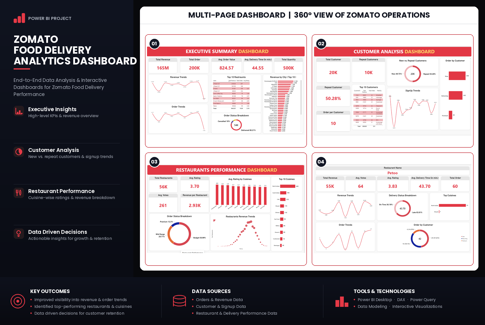

# 🍽️ Zomato Food Delivery Analytics Dashboard

## 📌 Project Overview

This project presents an end-to-end **Food Delivery Analytics solution built in Power BI** to analyze revenue, orders, customer behavior, restaurant performance, ratings, delivery efficiency, and business trends.

The solution transforms raw food-delivery data into a structured analytical model and presents insights through a **multi-page interactive Power BI dashboard**, providing a 360° view of business operations.

---

## 📊 Dashboard Preview



---

## 🎯 Business Objectives

The dashboard was developed to answer important business questions such as:

- How are revenue and orders changing over time?
- Which restaurants generate the highest revenue?
- What proportion of customers are repeat customers?
- Which cuisines and restaurants perform best?
- How efficiently are orders being delivered?
- What percentage of orders are cancelled or delivered late?
- How are restaurants distributed across Budget, Mid Range, and Premium segments?
- How does customer and restaurant performance change over time?

---

## 🛠️ Tools & Technologies

| Tool | Purpose |
|------|---------|
| **Power BI Desktop** | Dashboard development & reporting |
| **Power Query** | Data cleaning and transformation |
| **DAX** | Measures, KPIs and calculated columns |
| **Data Modeling** | Fact & dimension table relationships |
| **Excel** | Source dataset |
| **GitHub** | Project documentation & version control |

---

## 🗂️ Data Model

The project follows a structured analytical model with order data at the center and supporting dimension tables.

```text
                 ┌──────────────────┐
                 │  dim_datetable   │
                 └────────┬─────────┘
                          │
                          │ 1 : *
                          ▼
┌──────────────────┐   ┌───────────────┐   ┌──────────────────┐
│   dim_customer   │──▶│  fact_order   │◀──│    dim_restro    │
└──────────────────┘   └───────────────┘   └──────────────────┘
```

### Main Tables

**fact_order**
- Order ID
- Restaurant ID
- Customer ID
- Order Date
- Order Value
- Quantity
- Delivery Time
- Order Status

**dim_customer**
- Customer ID
- Customer Name
- City
- Signup Date
- Customer Type

**dim_restro**
- Restaurant ID
- Restaurant Name
- Rating
- Votes
- Cuisine
- Cost for Two
- Restaurant Type

**dim_datetable**
- Date
- Year
- Quarter
- Month
- Month Number
- Day

---

# 📐 DAX Calculations

## Calculated Columns

### Cost Bucket

Restaurants are segmented into three pricing categories.

```DAX
Cost Bucket =
SWITCH(
    TRUE(),
    dim_restro[CostForTwo] < 500, "Budget",
    dim_restro[CostForTwo] < 1000, "Mid Range",
    "Premium"
)
```

The categories are:

- **Budget:** Below ₹500
- **Mid Range:** ₹500–₹999
- **Premium:** ₹1000+

### Rating Bucket

```DAX
Rating Bucket =
SWITCH(
    TRUE(),
    dim_restro[Rating] >= 4.5, "Excellent",
    dim_restro[Rating] >= 4.0, "Good",
    dim_restro[Rating] >= 3.0, "Average",
    "Low"
)
```

### Delivery Status

```DAX
Delivery Status =
IF(
    fact_order[DeliveryTimeMins] > 45,
    "Late",
    "On Time"
)
```

### Order Month

```DAX
Order Month =
FORMAT(fact_order[OrderDate], "MMM YYYY")
```

---

# 📈 Core KPI Measures

```DAX
Total Orders =
COUNT(fact_order[OrderID])

Total Revenue =
SUM(fact_order[OrderValue])

Avg Order Value =
DIVIDE([Total Revenue], [Total Orders])

Avg Delivery Time =
AVERAGE(fact_order[DeliveryTimeMins])

Total Customers =
DISTINCTCOUNT(fact_order[CustomerID])

Total Restaurants =
DISTINCTCOUNT(dim_restro[RestaurantID])
```

These measures form the foundation of the dashboard's executive-level analysis.

---

## 🚚 Order Performance Measures

```DAX
Delivered Orders =
CALCULATE(
    [Total Orders],
    fact_order[OrderStatus] = "Delivered"
)

Cancelled Orders =
CALCULATE(
    [Total Orders],
    fact_order[OrderStatus] = "Cancelled"
)

Cancellation % =
DIVIDE(
    [Cancelled Orders],
    [Total Orders]
)

Late Orders =
CALCULATE(
    [Total Orders],
    fact_order[Delivery Status] = "Late"
)

Late Delivery % =
DIVIDE(
    [Late Orders],
    [Total Orders]
)
```

---

## 👥 Customer Measures

```DAX
Repeat Customers =
CALCULATE(
    COUNTROWS(dim_customer),
    dim_customer[CustomerType] IN {"Premium", "Returning"}
)

Repeat Customer % =
DIVIDE(
    [Repeat Customers],
    [Total Customers]
)

Orders Per Customer =
DIVIDE(
    [Total Orders],
    [Total Customers]
)
```

---

## 🍴 Restaurant Performance Measures

```DAX
Revenue per Restaurant =
DIVIDE(
    [Total Revenue],
    [Total Restaurants]
)

Avg Rating =
AVERAGE(dim_restro[Rating])

Avg Votes =
AVERAGE(dim_restro[Votes])
```

---

## ⏱️ Time Intelligence

### Revenue YTD

```DAX
Revenue YTD =
TOTALYTD(
    [Total Revenue],
    dim_datetable[Date]
)
```

### Orders YTD

```DAX
Orders YTD =
TOTALYTD(
    [Total Orders],
    dim_datetable[Date]
)
```

### Previous Month Revenue

```DAX
Revenue Previous Month =
CALCULATE(
    [Total Revenue],
    DATEADD(dim_datetable[Date], -1, MONTH)
)
```

### Revenue Growth %

```DAX
Revenue Growth % =
DIVIDE(
    [Total Revenue] - [Revenue Previous Month],
    [Revenue Previous Month]
)
```

---

# 📊 Dashboard Pages

## 1️⃣ Executive Summary Dashboard

Provides a high-level overview of overall business performance.

### Key KPIs
- Total Revenue
- Total Orders
- Average Order Value
- Average Delivery Time
- Total Quantity

### Analysis
- Revenue Trends
- Order Trends
- Top 10 Restaurants
- Revenue by City
- Order Status Breakdown

This page enables management to quickly understand overall platform performance.

---

## 2️⃣ Customer Analysis Dashboard

Focuses on customer acquisition, engagement and repeat behavior.

### Key Metrics
- Total Customers
- Repeat Customers
- Repeat Customer %
- Orders per Customer

### Analysis
- New vs Repeat Customers
- Customer Signup Trends
- Top 10 Customers
- Orders by Customer Type

This page helps identify valuable customers and understand customer retention patterns.

---

## 3️⃣ Restaurant Performance Dashboard

Provides restaurant-level and cuisine-level performance analysis.

### Key Metrics
- Total Restaurants
- Average Rating
- Average Votes
- Revenue per Restaurant

### Analysis
- Average Rating by Cuisine
- Top 10 Cuisines
- Cost Bucket Distribution
- Restaurant Revenue Trends

Restaurants are also segmented into:

**Budget | Mid Range | Premium**

to provide a clearer understanding of pricing distribution.

---

## 4️⃣ Restaurant Drill-Down Dashboard

Provides detailed analysis of an individual selected restaurant.

### Analysis
- Restaurant Revenue
- Average Votes
- Average Rating
- Average Delivery Time
- Total Orders
- Revenue Trends
- Order Trends
- Delivery Status
- Customer Type Distribution
- Top Cuisines

This page allows users to move from overall platform-level analysis to detailed restaurant-level performance.

---

# 💡 Key Dashboard Outcomes

The dashboard enables:

- Better visibility into **revenue and order trends**
- Identification of **top-performing restaurants and cuisines**
- Analysis of **new vs repeat customer behavior**
- Monitoring of **delivery performance**
- Identification of **late and cancelled orders**
- Comparison of restaurants across different **pricing segments**
- Restaurant-level performance analysis
- Data-driven decision-making for customer retention and operational improvement

---

# 🔄 Project Workflow

```text
Raw Dataset
     ↓
Data Cleaning
     ↓
Power Query Transformation
     ↓
Data Modeling
     ↓
Calculated Columns
     ↓
DAX Measures & KPIs
     ↓
Interactive Visualizations
     ↓
Multi-Page Power BI Dashboard
     ↓
Business Insights
```

---

# 📁 Repository Structure

```text
Zomato-Food-Delivery-Analytics/
│
├── README.md
│
├── food delivery plans.pbix
│
├── dataset.xlsx
│
└── images/
    └── Zomato_Analytics_Dashboard_Poster.png
```

---

# 🚀 Key Skills Demonstrated

`Power BI` `DAX` `Power Query` `Data Modeling` `Data Cleaning` `Data Visualization` `Business Intelligence` `KPI Analysis` `Customer Analytics` `Restaurant Analytics` `Time Intelligence`

---

## 👨‍💻 Author

**Jatindra Kumar Soni**

Data Analyst | Product Analytics

If you found this project useful, consider giving the repository a ⭐.
